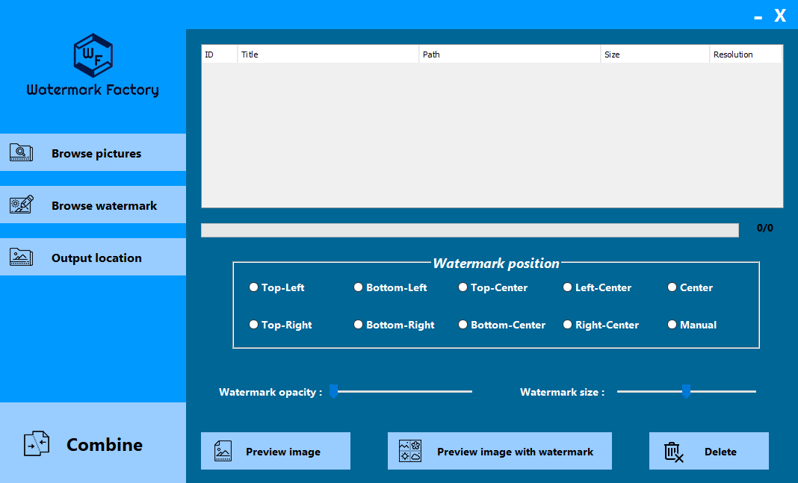

# WatermarkFactory

_________________________________________________________________________________________________________________________________________________________________________________

## Functionality:

Placing selected watermark on selected group of pictures. You have the option of chooseing size of watermark, opacity of watermark and position of watermark. There are some predefined position and option for manual positioning (which doesn't work right now :sweat_smile:)

<b>Application design</b>

_________________________________________________________________________________________________________________________________________________________________________________

## How to use:

1. Click on button **"Browse pictures"** and choose the group of pictures that you want to put watermark on
2. Click on button **"Browse watermark"** and choose one image file that will bi used as watermark
3. Click on button **"Output location"** to define the output folder of watermarked pictures
4. Select **"Watermark position"**
5. Determine **"Watermark opacity"**
6. Determine **"Watermark size"**
7. Click on button **"Combine"** and wait for application to finish watermarking
8. Your watermarked pictures should be in defined output folder

_________________________________________________________________________________________________________________________________________________________________________________

## Use of other buttons while configuring watermark
- **Preview image** - Select a picture from list of pictures and click on this button to preview selected image (maybe you selected something you don't want to watermark)
- **Preview image with watermark** - Select a picture from list of pictures and click on this button to preview selected image with watermark and his current configuration (position, size, opacity)
- **Delete** - Deletes selected picture from list
_________________________________________________________________________________________________________________________________________________________________________________

**NetBeans project*
